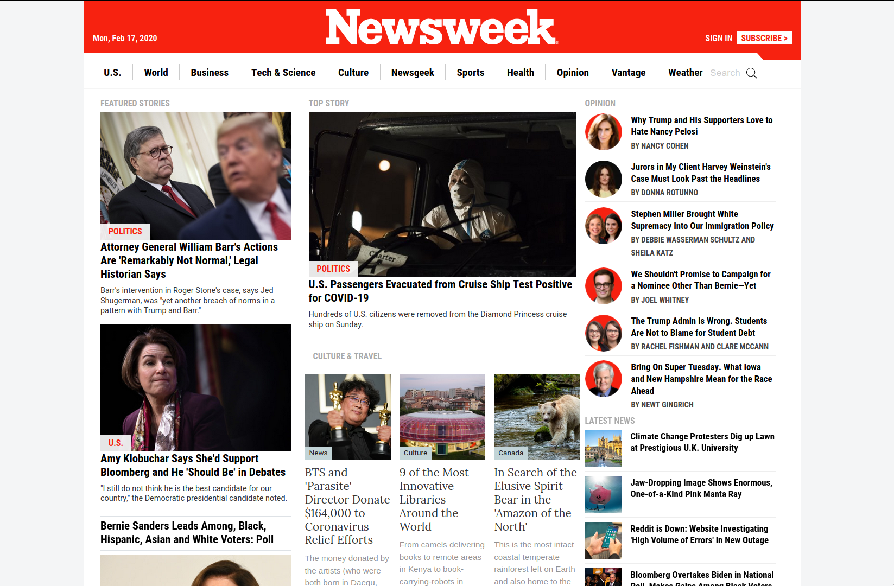

# Responsive-Design
>  Building a clone of the [newsweek magazine](https://newsweek.com) website as part of Microverse's Full Stack Development program

This personal project aims at being a hands on experience to learn [the boostrap css library](https://getbootstrap.com/).
[Bootstrap](https://getbootstrap.com/) is used extensively, re-arranging the content with its responsible break-points and changing margins and paddings accordingly. 
A hint of javascript through the [jquery](https://jquery.com/) library is also used to add a dynamic header.

### Built With
    html
    css (bootstrap)
    js (jquery, used to detect scrolling and change the header)
### Check it online!
[Live preview](https://raw.githack.com/fc-anjos/newsweek-clone/section-ordering/index.html)

### Authors:
##### Felipe dos Anjos
GitHub: [@fc-anjos](https://github.com/fc-anjos)  

<!-- ACKNOWLEDGEMENTS -->
## Acknowledgements
* [Maria Reyes](https://github.com/majovanilla) for the rigorous review

<!-- LICENSE -->
## License
Distributed under the MIT License. 

### Contributions and issues are welcome!

